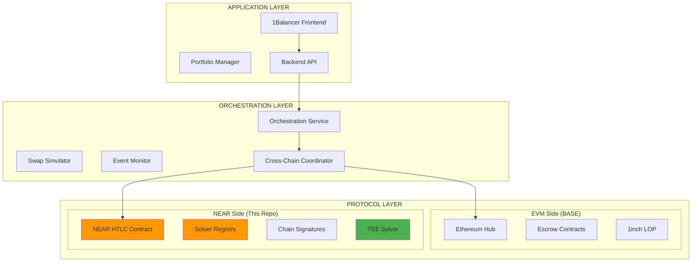
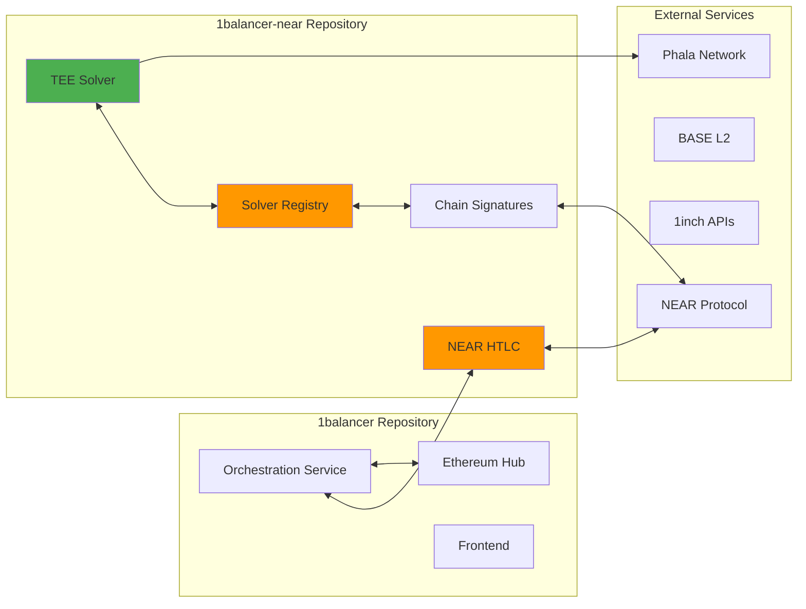
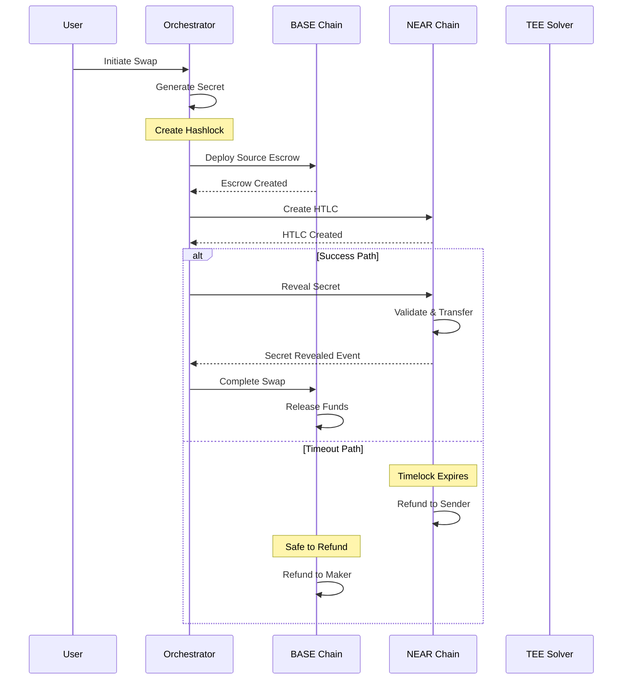
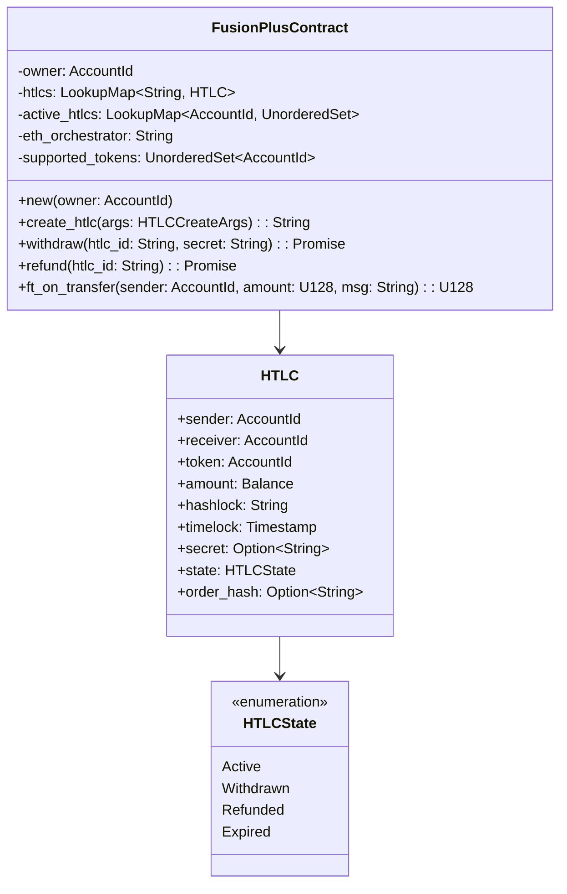
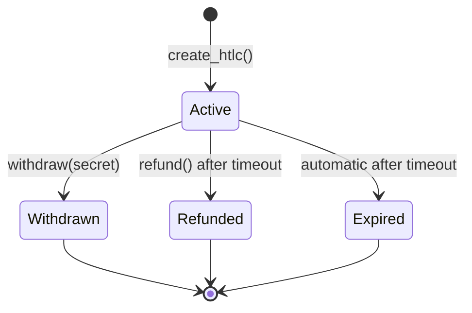
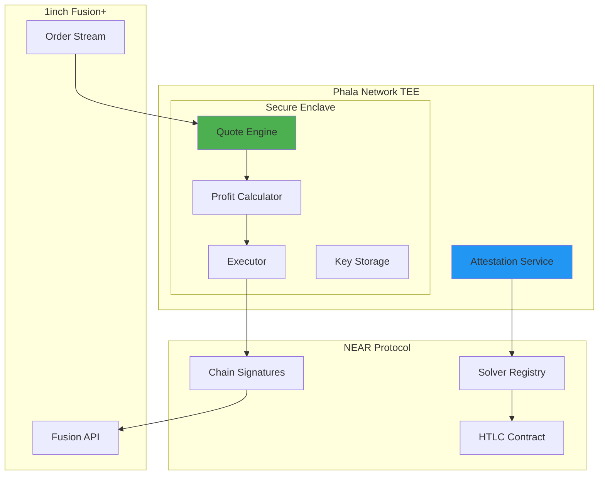
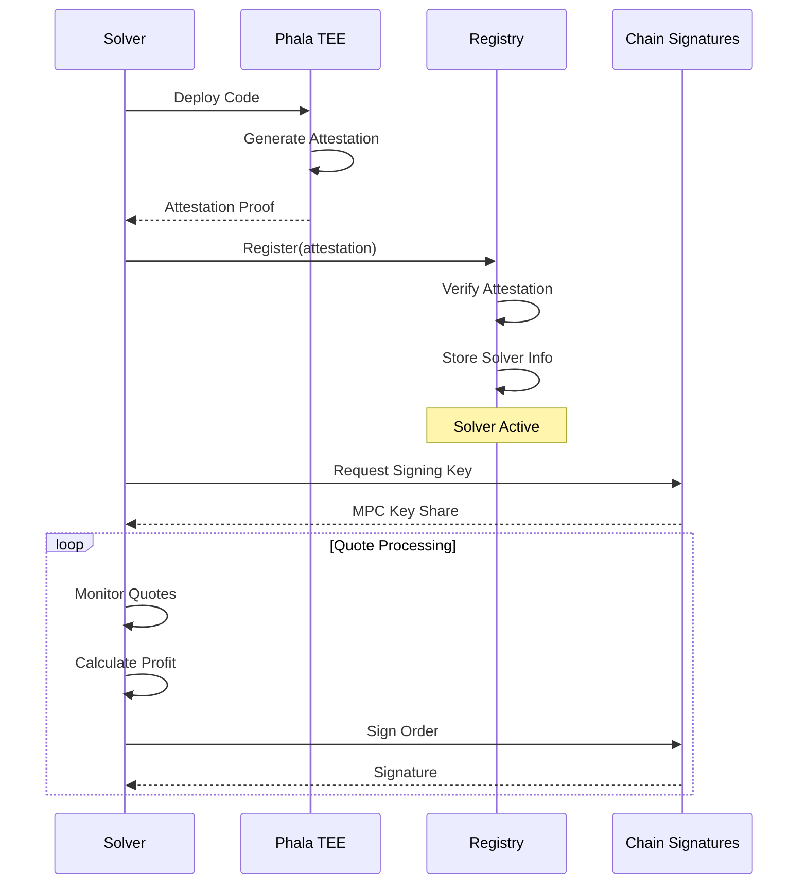
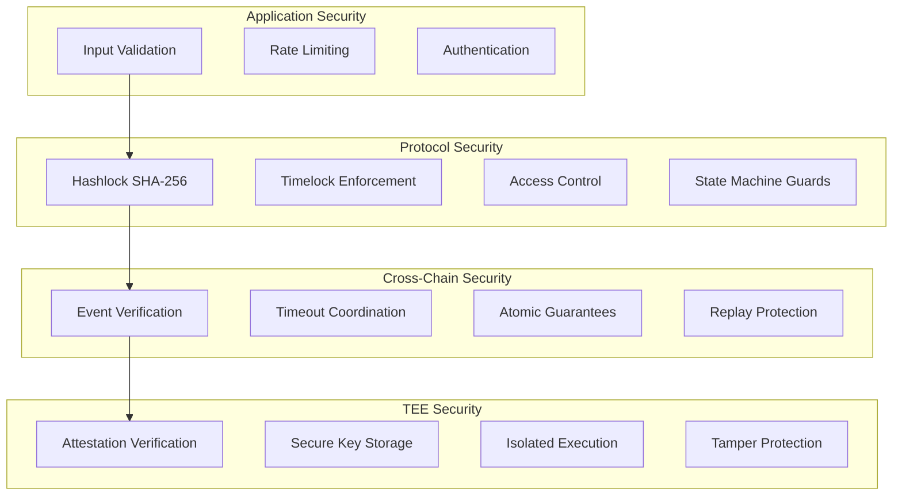
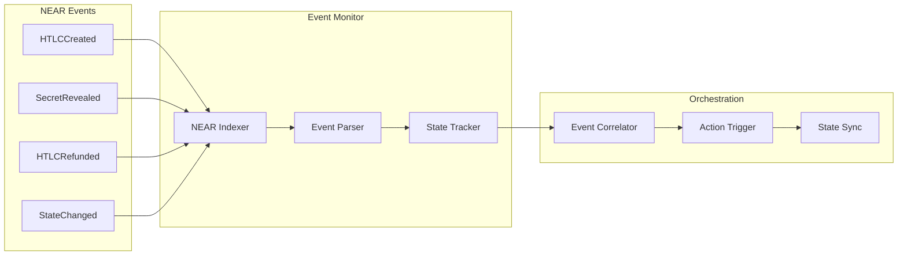
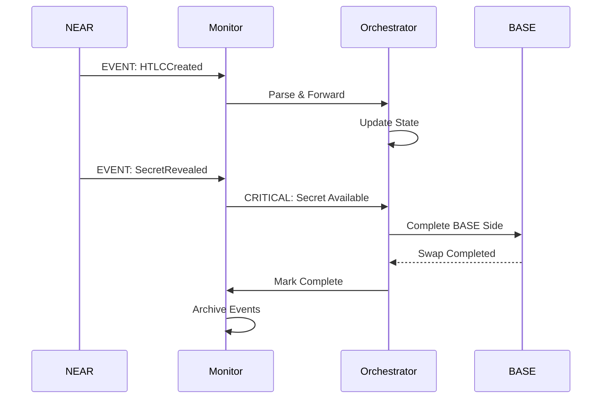

# 1Balancer NEAR Architecture

## Table of Contents

1. [Overview](#overview)
2. [System Architecture](#system-architecture)
3. [Cross-Chain Integration](#cross-chain-integration)
4. [NEAR Contract Architecture](#near-contract-architecture)
5. [TEE Solver Architecture](#tee-solver-architecture)
6. [Security Architecture](#security-architecture)
7. [Event Flow and Monitoring](#event-flow-and-monitoring)
8. [Integration Points](#integration-points)

## Overview

The 1Balancer NEAR repository implements the NEAR Protocol side of the cross-chain atomic swap system, enabling trustless portfolio rebalancing between NEAR and EVM chains (primarily BASE). This architecture extends the Ethereum Hub design to support non-EVM chains through the Fusion+ protocol.

## System Architecture

### Three-Layer Architecture Extension

Building upon the Ethereum Hub's three-layer pattern, NEAR integration adds:



### Component Relationships



## Cross-Chain Integration

### Atomic Swap Flow

The NEAR integration implements the destination chain side of the atomic swap protocol:



### Timeout Coordination

Critical for atomicity, the timeout structure ensures safe execution:

```mermaid
gantt
    title Cross-Chain Timeout Coordination
    dateFormat HH:mm
    axisFormat %H:%M
    
    section NEAR Chain
    Active Period           :active, near1, 00:00, 24:00
    Refund Available        :crit, near2, 24:00, 48:00
    
    section BASE Chain
    Active Period           :active, base1, 00:00, 48:00
    Public Withdrawal       :done, base2, 48:00, 60:00
    Refund Available        :crit, base3, 60:00, 72:00
```

**Key Rule**: NEAR timeout (T_near) < BASE withdrawal (T_base)
- If NEAR fails, BASE can safely refund
- If NEAR succeeds, secret is available for BASE completion

## NEAR Contract Architecture

### Contract Structure



### Module Organization

```
contracts/fusion-plus-htlc/
├── src/
│   ├── lib.rs              # Main contract logic
│   ├── types.rs            # Data structures
│   ├── utils.rs            # Helper functions
│   ├── htlc/               # HTLC operations
│   │   ├── create.rs       # Creation logic
│   │   ├── withdraw.rs     # Secret revelation
│   │   └── refund.rs       # Timeout refunds
│   ├── cross_chain/        # Cross-chain coordination
│   │   ├── coordinator.rs  # State sync
│   │   └── events.rs       # Event emission
│   └── ft_receiver.rs      # NEP-141 support
```

### State Machine



## TEE Solver Architecture

### Decentralized Solver Design



### Solver Registration Flow



## Security Architecture

### Multi-Layer Security Model



### Attack Vector Mitigation

| Attack Vector | Mitigation Strategy |
|--------------|-------------------|
| Front-running | TEE execution isolation |
| Replay attacks | One-time secret usage |
| Timeout manipulation | Strict timestamp validation |
| Cross-chain race conditions | Enforced timeout ordering |
| Malicious solvers | TEE attestation requirement |
| Secret pre-revelation | SHA-256 commitment scheme |

## Event Flow and Monitoring

### Event Architecture



### Critical Event Sequence



## Integration Points

### 1. Orchestration Service Integration

```typescript
interface NEARIntegration {
    // Contract calls
    createHTLC(params: HTLCParams): Promise<string>;
    getHTLCStatus(id: string): Promise<HTLCState>;
    
    // Event monitoring
    onHTLCCreated(callback: (event: HTLCCreatedEvent) => void): void;
    onSecretRevealed(callback: (event: SecretRevealedEvent) => void): void;
    
    // State queries
    getActiveHTLCs(): Promise<HTLCInfo[]>;
    getCrossChainInfo(htlcId: string): Promise<CrossChainInfo>;
}
```

### 2. Frontend Integration

```typescript
// Hooks for NEAR integration
const useNEARSwap = () => {
    const createSwap = async (params: SwapParams) => {
        // Call orchestration service
        const session = await orchestrator.createSession({
            sourceChain: 'base',
            destinationChain: 'near',
            ...params
        });
        return session;
    };
    
    const monitorSwap = (sessionId: string) => {
        // WebSocket monitoring
        return orchestrator.subscribe(sessionId);
    };
    
    return { createSwap, monitorSwap };
};
```

### 3. Chain Signatures Integration

```rust
// MPC signing for solver operations
impl ChainSignatureClient {
    pub async fn request_signature(
        &self,
        payload: &[u8],
        path: &str,
    ) -> Result<Signature, Error> {
        // MPC protocol execution
        let request = SignatureRequest {
            payload: payload.to_vec(),
            path: path.to_string(),
            key_version: self.key_version,
        };
        
        self.mpc_contract
            .sign(request)
            .await
    }
}
```

## Performance Considerations

### Optimization Strategies

1. **Event Batching**: Process multiple events in single transaction
2. **State Caching**: Minimize cross-contract calls
3. **Gas Optimization**: Efficient data structures and storage patterns
4. **Parallel Processing**: Independent HTLC operations

### Benchmarks

| Operation | Gas Cost | Time |
|-----------|----------|------|
| Create HTLC | ~5 TGas | <2s |
| Withdraw | ~10 TGas | <3s |
| Refund | ~5 TGas | <2s |
| TEE Attestation | ~20 TGas | <5s |

## Future Enhancements

1. **Multi-signature HTLCs**: Support for complex authorization
2. **Batch Operations**: Multiple swaps in single transaction
3. **Advanced TEE Features**: Zero-knowledge proofs, private swaps
4. **Additional Chains**: Cosmos, Solana integration
5. **Liquidity Aggregation**: Cross-chain liquidity pools

## Conclusion

The NEAR integration extends 1Balancer's cross-chain capabilities to non-EVM ecosystems while maintaining the security and atomicity guarantees of the Fusion+ protocol. The architecture prioritizes:

- **Security**: Multi-layer validation and TEE isolation
- **Scalability**: Efficient event processing and state management
- **Usability**: Hidden complexity behind simple interfaces
- **Extensibility**: Modular design for future enhancements