# Cross-Chain Workflow Documentation

## Overview

This document details the complete cross-chain atomic swap workflow between BASE (Ethereum L2) and NEAR Protocol,
showing how the two chains coordinate to ensure atomic execution.

## Workflow Architecture

### High-Level Flow

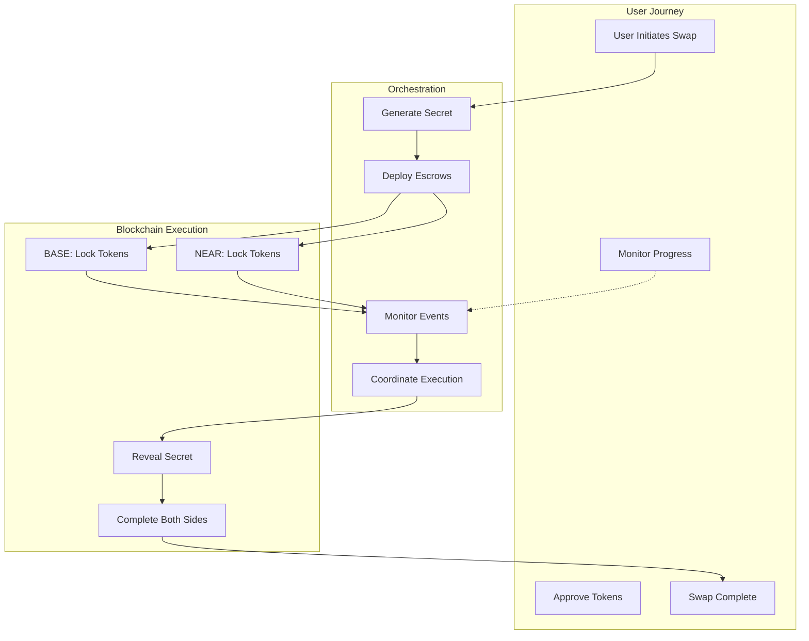

## Detailed Workflow Steps

### 1. Initialization Phase

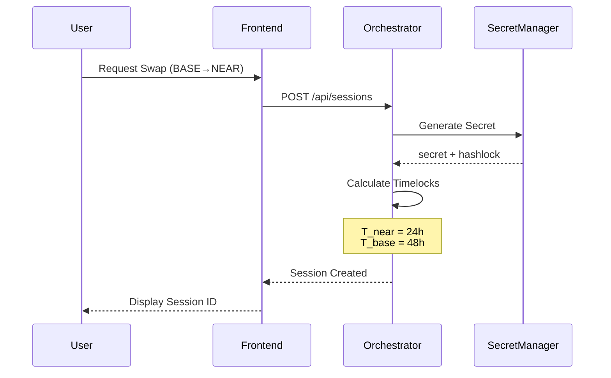

### 2. Source Chain Lock (BASE)

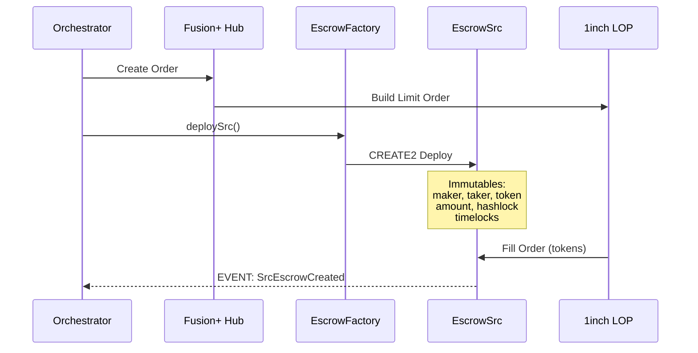

### 3. Destination Chain Lock (NEAR)

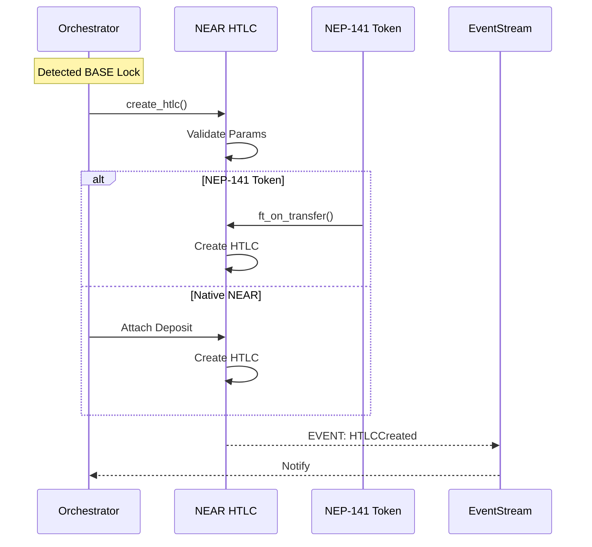

### 4. Secret Revelation Phase

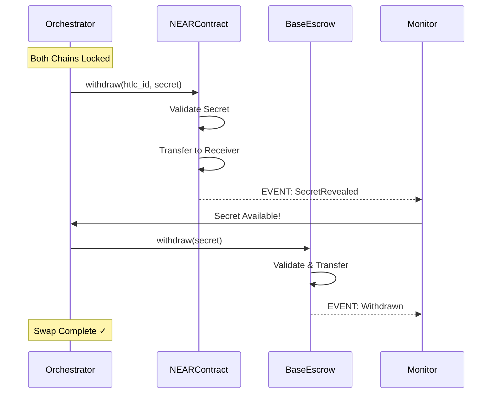

### 5. Timeout Handling

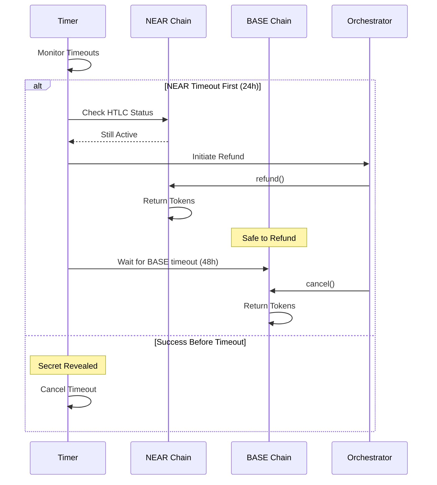

## State Management

### Session States

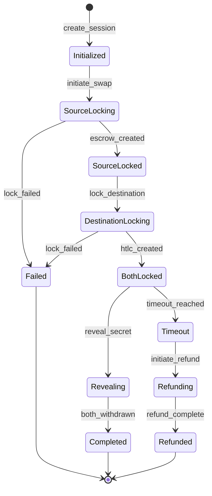

### Event Correlation

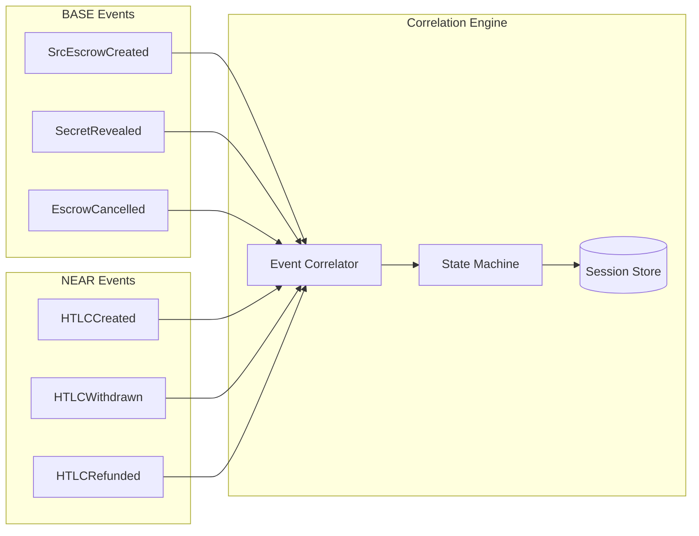

## Error Scenarios

### 1. NEAR Lock Failure

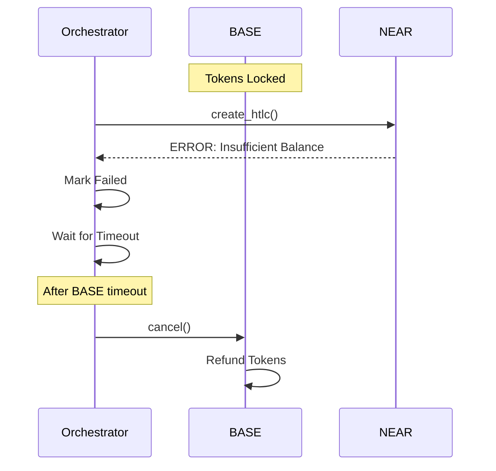

### 2. Network Partition

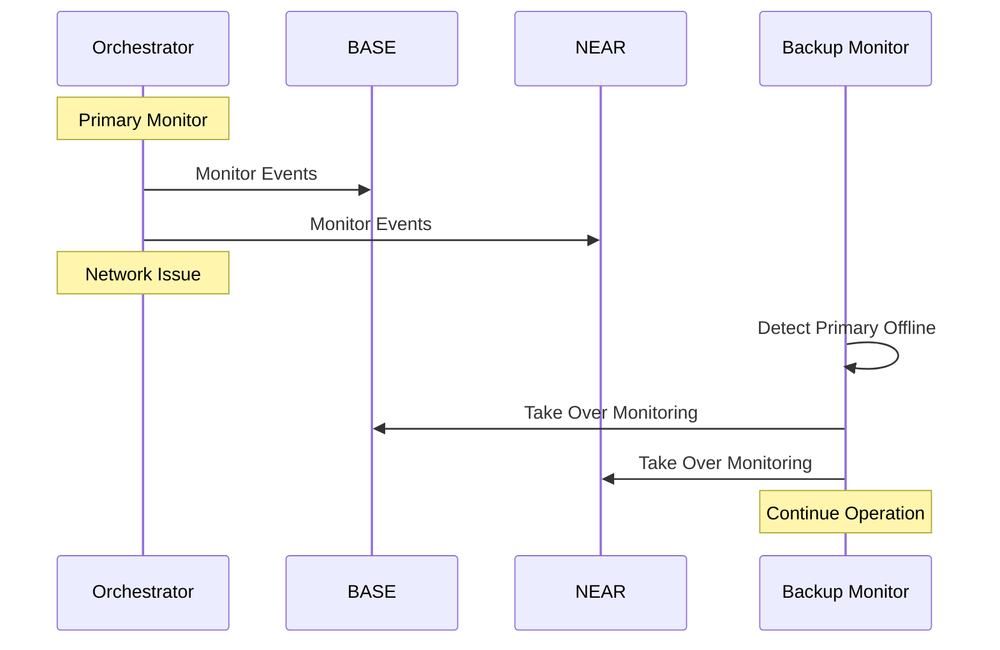

## Performance Optimization

### Parallel Processing

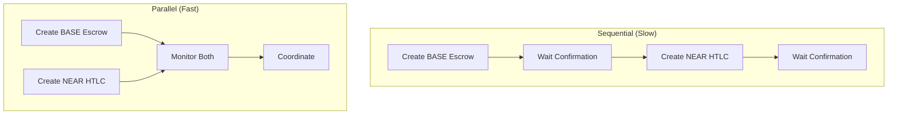

### Event Batching

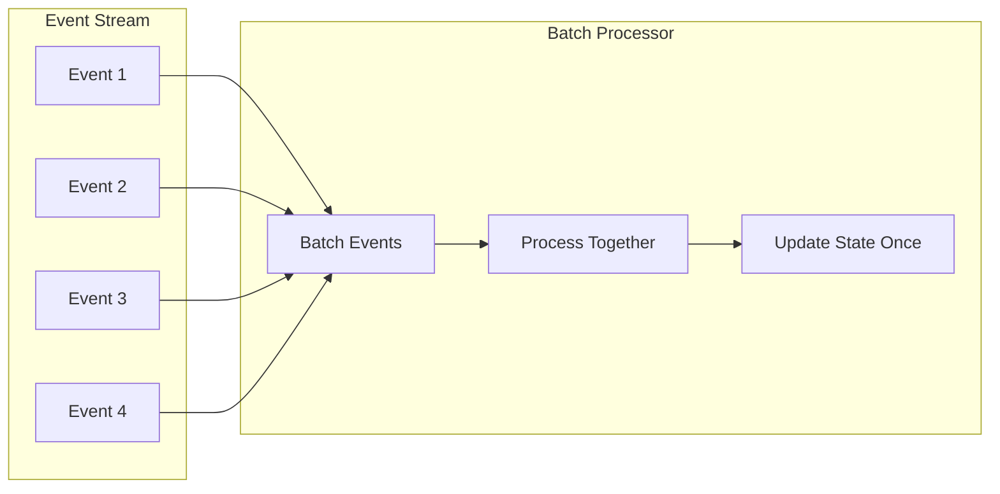

## Monitoring and Analytics

### Key Metrics

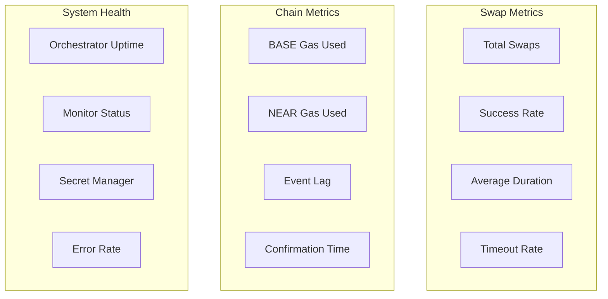

### Monitoring Dashboard

```
┌─────────────────────────────────────────────────┐
│            Cross-Chain Swap Monitor             │
├─────────────────────────────────────────────────┤
│ Active Swaps: 12    │ Completed Today: 156     │
│ Success Rate: 98.5% │ Avg Duration: 3m 24s     │
├─────────────────────────────────────────────────┤
│ Chain Status        │ Latest Events            │
│ BASE:   ✅ Connected │ SrcEscrowCreated  2m ago │
│ NEAR:   ✅ Connected │ HTLCWithdrawn     1m ago │
├─────────────────────────────────────────────────┤
│ Recent Swaps                                    │
│ #1234: BASE→NEAR  1000 USDC  ✅ Complete        │
│ #1235: NEAR→BASE  50 NEAR    ⏳ Processing     │
│ #1236: BASE→NEAR  500 USDT   ⏳ Processing     │
└─────────────────────────────────────────────────┘
```

## Security Considerations

### Attack Prevention

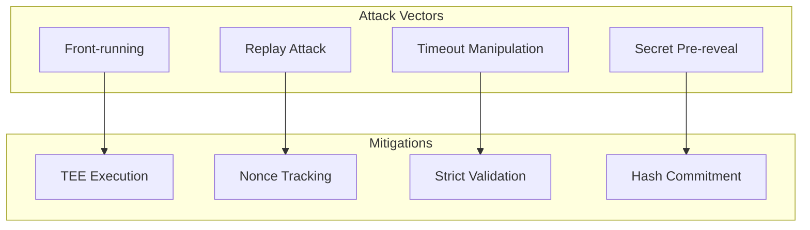

### Security Checklist

- [ ] Secret generation uses cryptographically secure random
- [ ] Hashlock validation on both chains
- [ ] Timeout ordering enforced (T_near < T_base)
- [ ] Event authenticity verification
- [ ] Access control on critical functions
- [ ] Reentrancy protection
- [ ] Integer overflow protection
- [ ] Emergency pause mechanism

## Integration Guide

### For Frontend Developers

```typescript
// Simple swap initiation
const swap = await orchestrator.createSwap({
    from: 'base',
    to: 'near',
    token: 'USDC',
    amount: '1000',
    recipient: 'alice.near'
});

// Monitor progress
swap.on('status', (status) => {
    console.log(`Swap ${status.step}: ${status.message}`);
});

// Handle completion
swap.on('complete', (result) => {
    console.log('Swap completed!', result.txHashes);
});
```

### For Backend Integration

```typescript
// Orchestration service integration
class SwapOrchestrator {
    async handleSwap(params: SwapParams) {
        // 1. Generate secret
        const { secret, hashlock } = await this.generateSecret();
        
        // 2. Calculate timelocks
        const timelocks = this.calculateTimelocks();
        
        // 3. Deploy on both chains
        const [baseTx, nearTx] = await Promise.all([
            this.deployBaseEscrow(params, hashlock, timelocks),
            this.createNEARHTLC(params, hashlock, timelocks)
        ]);
        
        // 4. Monitor and coordinate
        await this.monitorAndComplete(baseTx, nearTx, secret);
    }
}
```

## Conclusion

The cross-chain workflow ensures atomic execution through careful coordination of:

1. **Timeout Management**: NEAR expires before BASE
2. **Secret Management**: One-time reveal ensures atomicity
3. **Event Monitoring**: Real-time state synchronization
4. **Error Handling**: Graceful degradation and recovery

This design enables trustless cross-chain swaps while maintaining security and performance.