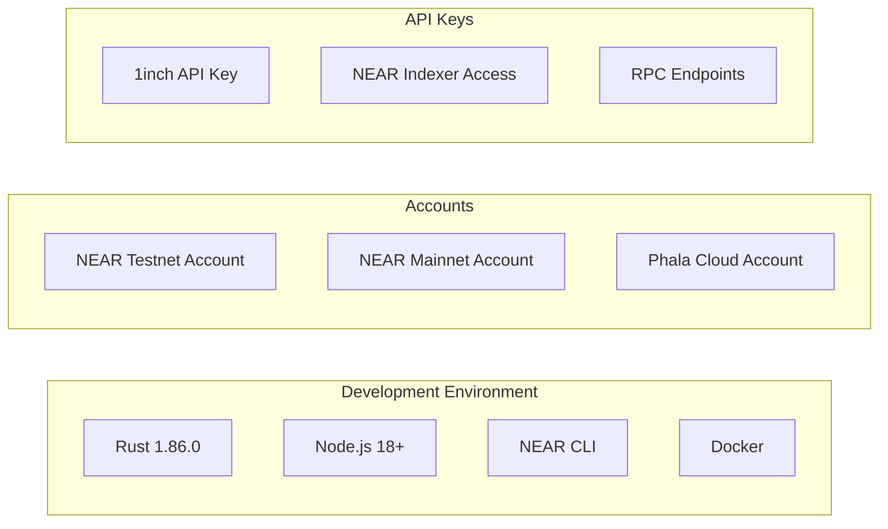
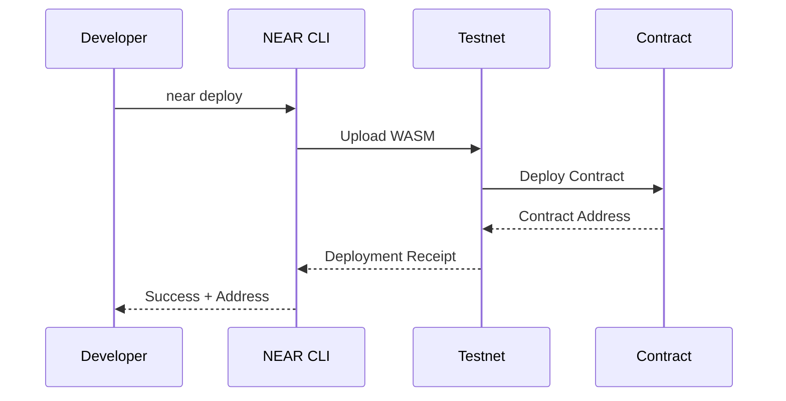
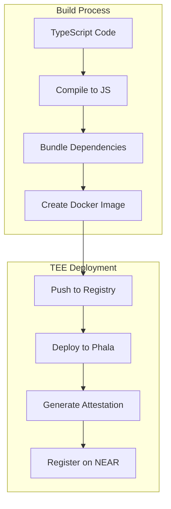
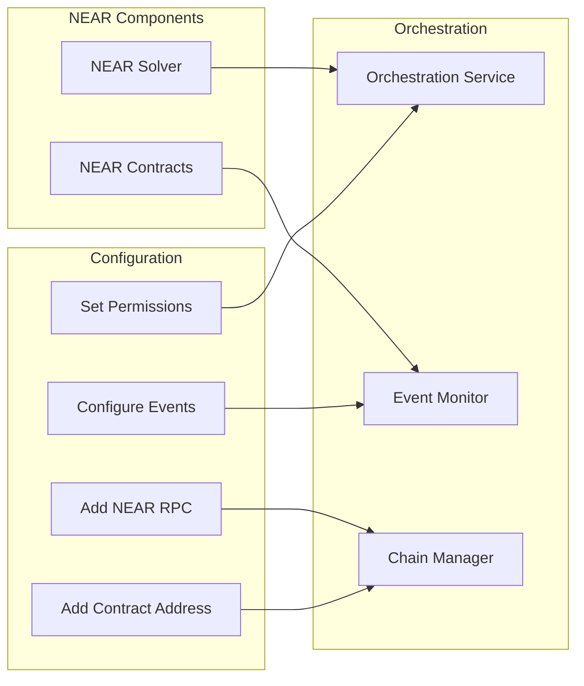
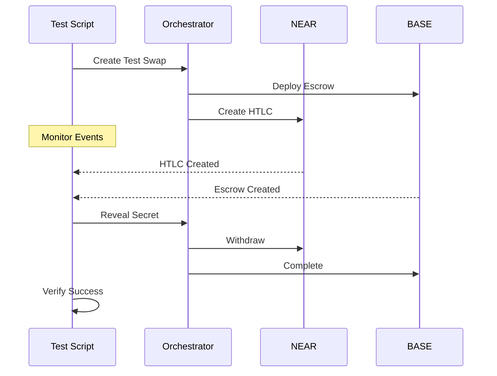
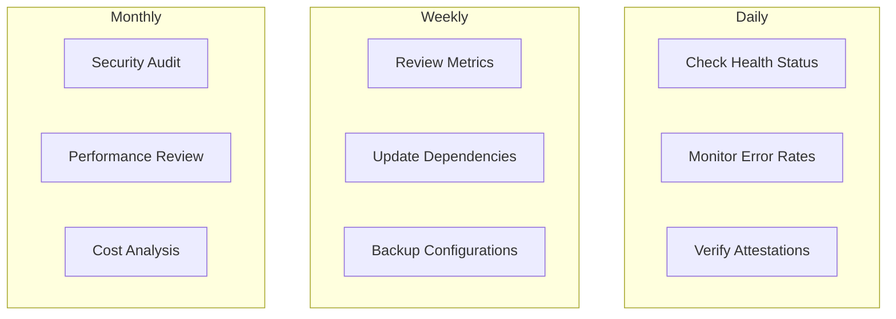

# NEAR Deployment Guide

## Overview

This guide provides step-by-step instructions for deploying the 1Balancer NEAR components, including smart contracts, TEE solver, and integration with the orchestration service.

## Prerequisites

### System Requirements



### Installation Checklist

```bash
# 1. Install Rust 1.86.0 exactly
curl --proto '=https' --tlsv1.2 -sSf https://sh.rustup.rs | sh
rustup install 1.86.0
rustup default 1.86.0
rustup target add wasm32-unknown-unknown

# 2. Install NEAR CLI
npm install -g near-cli-rs@latest

# 3. Install development tools
npm install -g typescript ts-node
cargo install cargo-near

# 4. Verify installations
rustc --version  # Should show 1.86.0
near --version
cargo near --version
```

## Contract Deployment

### 1. Build Contracts

```bash
# Clone and navigate to repository
git clone https://github.com/1balancer/1balancer-near.git
cd 1balancer-near

# Build all contracts
make build

# Or build individually
cd contracts/fusion-plus-htlc
./build.sh

cd ../solver-registry
cargo build --target wasm32-unknown-unknown --release
```

### 2. Deploy to Testnet



```bash
# Login to NEAR testnet
near login

# Create contract account
near create-account fusion-htlc.testnet --masterAccount YOUR_ACCOUNT.testnet

# Deploy HTLC contract
near deploy \
  --accountId fusion-htlc.testnet \
  --wasmFile target/wasm32-unknown-unknown/release/fusion_plus_htlc.wasm

# Initialize contract
near call fusion-htlc.testnet new \
  '{"owner": "YOUR_ACCOUNT.testnet"}' \
  --accountId YOUR_ACCOUNT.testnet
```

### 3. Deploy to Mainnet

```bash
# Switch to mainnet
export NEAR_ENV=mainnet

# Create mainnet account (requires NEAR tokens)
near create-account fusion-htlc.near --masterAccount YOUR_ACCOUNT.near

# Deploy with initialization
near deploy \
  --accountId fusion-htlc.near \
  --wasmFile target/wasm32-unknown-unknown/release/fusion_plus_htlc.wasm \
  --initFunction "new" \
  --initArgs '{"owner": "YOUR_ACCOUNT.near"}'
```

## TEE Solver Deployment

### 1. Prepare Solver



```bash
# Navigate to solver directory
cd shade-agent-solver

# Install dependencies
npm install

# Build solver
npm run build

# Build Docker image
docker build -t fusion-solver:latest .

# Test locally
docker-compose up
```

### 2. Deploy to Phala Network

```yaml
# deployment/phala-config.yaml
apiVersion: apps/v1
kind: Deployment
metadata:
  name: fusion-solver
spec:
  replicas: 1
  selector:
    matchLabels:
      app: fusion-solver
  template:
    metadata:
      labels:
        app: fusion-solver
    spec:
      containers:
      - name: solver
        image: fusion-solver:latest
        env:
        - name: NEAR_NETWORK
          value: "mainnet"
        - name: ATTESTATION_MODE
          value: "production"
        resources:
          limits:
            sgx.intel.com/enclave: 1
```

```bash
# Deploy to Phala
cd deployment
./deploy-solver-tee.sh

# Verify deployment
phala-cli status --deployment fusion-solver

# Get attestation
phala-cli attestation --deployment fusion-solver > attestation.json
```

### 3. Register Solver on NEAR

```bash
# Register solver with attestation
near call solver-registry.near register_solver \
  "$(cat attestation.json)" \
  --accountId solver.near \
  --deposit 10
```

## Configuration

### Environment Variables

```bash
# .env.testnet
NEAR_ENV=testnet
NEAR_ACCOUNT_ID=fusion-htlc.testnet
ORCHESTRATOR_URL=https://orchestrator.1balancer.com
INDEXER_URL=https://api.nearblocks.io/v1/testnet

# .env.mainnet
NEAR_ENV=mainnet
NEAR_ACCOUNT_ID=fusion-htlc.near
ORCHESTRATOR_URL=https://orchestrator.1balancer.com
INDEXER_URL=https://api.nearblocks.io/v1/mainnet
```

### Contract Configuration

```bash
# Set orchestrator address
near call fusion-htlc.testnet set_eth_orchestrator \
  '{"orchestrator": "0x1234..."}' \
  --accountId owner.testnet

# Add supported tokens
near call fusion-htlc.testnet add_supported_token \
  '{"token": "usdt.testnet"}' \
  --accountId owner.testnet

# Configure solver registry
near call solver-registry.testnet set_attestation_validator \
  '{"validator": "phala-validator.testnet"}' \
  --accountId owner.testnet
```

## Integration Setup

### 1. Connect to Orchestration Service



```typescript
// orchestration/config/near.ts
export const nearConfig = {
  networkId: process.env.NEAR_ENV || 'testnet',
  nodeUrl: process.env.NEAR_NODE_URL || 'https://rpc.testnet.near.org',
  contracts: {
    htlc: process.env.HTLC_CONTRACT || 'fusion-htlc.testnet',
    solverRegistry: process.env.SOLVER_REGISTRY || 'solver-registry.testnet'
  },
  indexer: {
    url: process.env.INDEXER_URL,
    apiKey: process.env.INDEXER_API_KEY
  }
};
```

### 2. Event Monitoring Setup

```typescript
// orchestration/monitors/near-monitor.ts
export class NEAREventMonitor {
  async start() {
    // Subscribe to contract events
    await this.indexer.subscribe({
      accounts: [this.config.contracts.htlc],
      events: ['htlc_created', 'secret_revealed', 'htlc_refunded']
    });
    
    // Process events
    this.indexer.on('event', async (event) => {
      await this.processEvent(event);
    });
  }
}
```

## Verification

### 1. Contract Verification

```bash
# Verify contract deployment
near view fusion-htlc.testnet get_owner

# Test HTLC creation
near call fusion-htlc.testnet create_htlc \
  '{
    "args": {
      "receiver": "alice.testnet",
      "token": "near",
      "amount": "1000000000000000000000000",
      "hashlock": "0x9c22ff5f21f0b81b113e63f7db6da94fedef11b2119b4088b89664fb9a3cb658",
      "timelock": 1234567890,
      "order_hash": "0xtest"
    }
  }' \
  --accountId bob.testnet \
  --deposit 1
```

### 2. Solver Verification

```bash
# Check solver registration
near view solver-registry.testnet get_solver '{"solver_id": "solver.testnet"}'

# Verify attestation
near view solver-registry.testnet verify_attestation \
  '{"solver_id": "solver.testnet"}'
```

### 3. Integration Testing



## Monitoring

### Health Checks

```bash
# Contract health
curl https://api.1balancer.com/health/near

# Response
{
  "status": "healthy",
  "contracts": {
    "htlc": "operational",
    "solver_registry": "operational"
  },
  "solver": {
    "status": "active",
    "attestation": "valid"
  },
  "lastBlock": 123456789
}
```

### Metrics Dashboard

```
┌─────────────────────────────────────────────────┐
│           NEAR Deployment Status                │
├─────────────────────────────────────────────────┤
│ Network: Testnet                                │
│ Contracts:                                      │
│   • HTLC:           ✅ fusion-htlc.testnet      │
│   • Solver Registry: ✅ solver-registry.testnet │
│                                                 │
│ TEE Solver:                                     │
│   • Status:         ✅ Active                   │
│   • Attestation:    ✅ Valid                    │
│   • Last Heartbeat: 2 minutes ago              │
│                                                 │
│ Integration:                                    │
│   • Orchestrator:   ✅ Connected                │
│   • Event Monitor:  ✅ Synced                   │
│   • Chain Status:   ✅ Operational              │
└─────────────────────────────────────────────────┘
```

## Troubleshooting

### Common Issues

1. **Contract Deployment Fails**
   ```bash
   # Check account balance
   near state YOUR_ACCOUNT.testnet
   
   # Ensure sufficient balance for storage
   # Minimum: 10 NEAR for contract deployment
   ```

2. **TEE Attestation Invalid**
   ```bash
   # Regenerate attestation
   phala-cli attestation --fresh
   
   # Verify TEE environment
   phala-cli diagnose
   ```

3. **Event Monitoring Lag**
   ```bash
   # Check indexer status
   curl $INDEXER_URL/status
   
   # Restart monitor
   pm2 restart near-monitor
   ```

### Debug Commands

```bash
# Enable debug logging
export NEAR_DEBUG=true
export RUST_LOG=debug

# View contract logs
near logs fusion-htlc.testnet

# Inspect transactions
near tx-status TX_HASH --accountId YOUR_ACCOUNT.testnet
```

## Maintenance

### Regular Tasks



### Upgrade Process

```bash
# 1. Build new version
cd contracts/fusion-plus-htlc
./build.sh

# 2. Deploy to testnet first
near deploy --accountId fusion-htlc-v2.testnet

# 3. Run migration tests
npm run test:migration

# 4. Deploy to mainnet with upgrade
near deploy --accountId fusion-htlc.near
```

## Security Checklist

- [ ] All environment variables secured
- [ ] Private keys in hardware security module
- [ ] Multi-signature for admin functions
- [ ] Monitoring alerts configured
- [ ] Backup and recovery plan tested
- [ ] Incident response procedures documented
- [ ] Regular security audits scheduled

## Conclusion

Successful deployment requires:

1. **Proper Environment Setup**: Exact Rust version and tools
2. **Systematic Deployment**: Test on testnet first
3. **TEE Configuration**: Valid attestation and registration
4. **Integration Testing**: Verify all connections
5. **Monitoring Setup**: Real-time health and alerts
6. **Security Measures**: Multi-layer protection

Follow this guide step-by-step for a secure and reliable deployment.