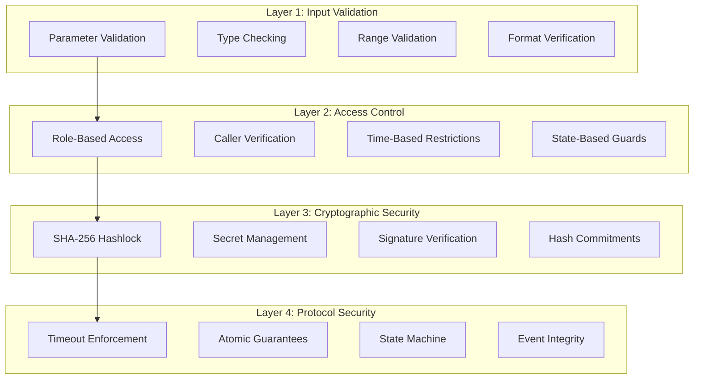
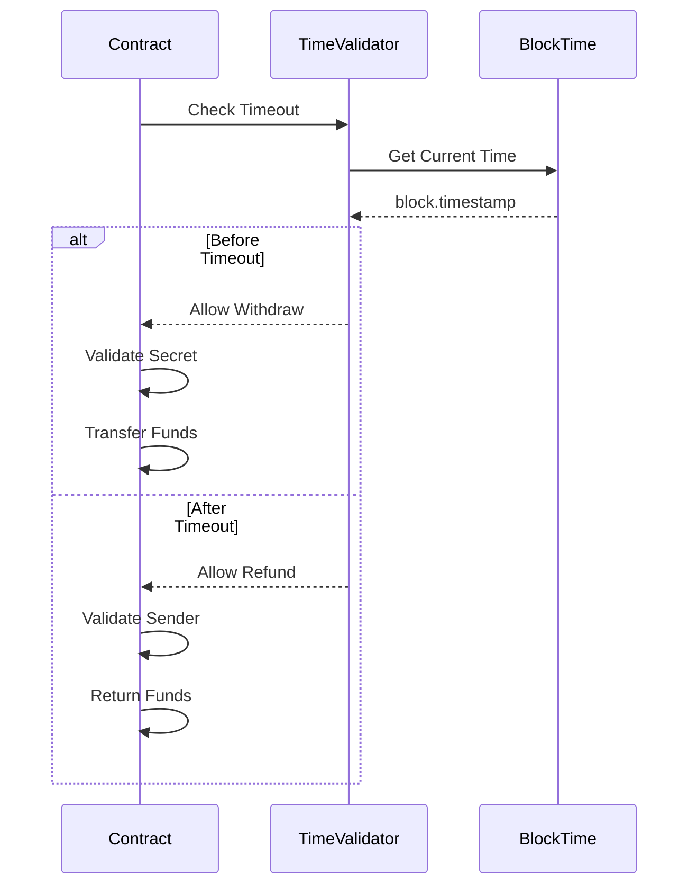
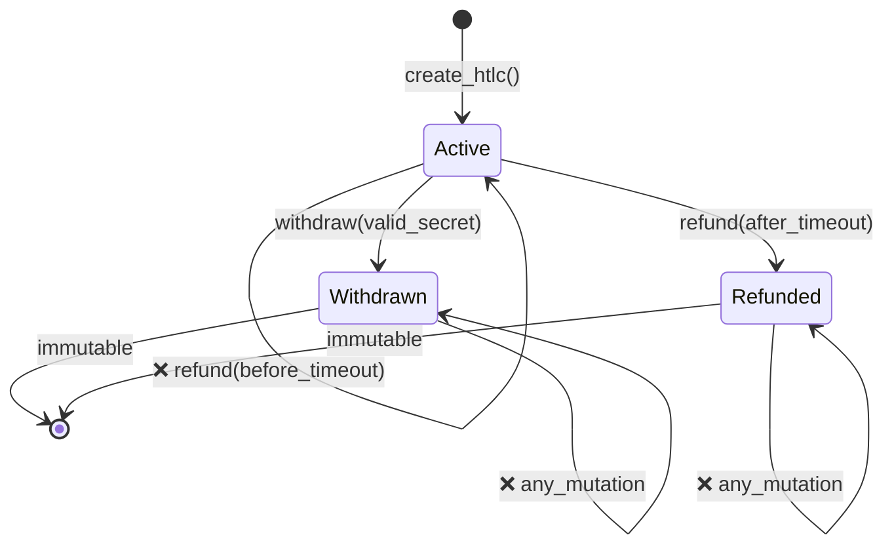
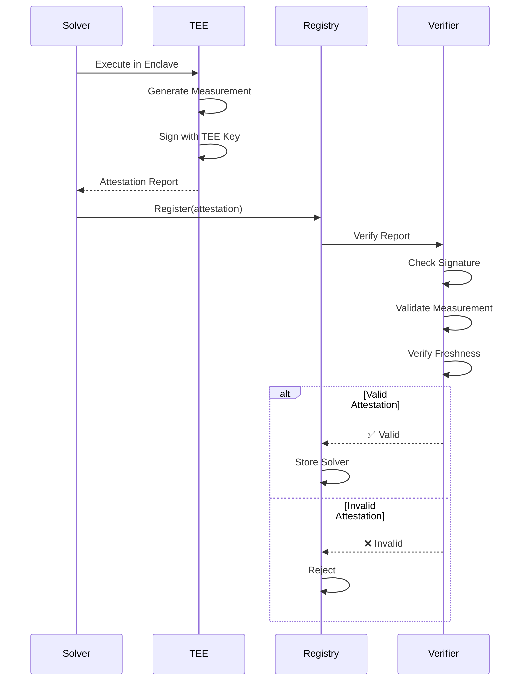
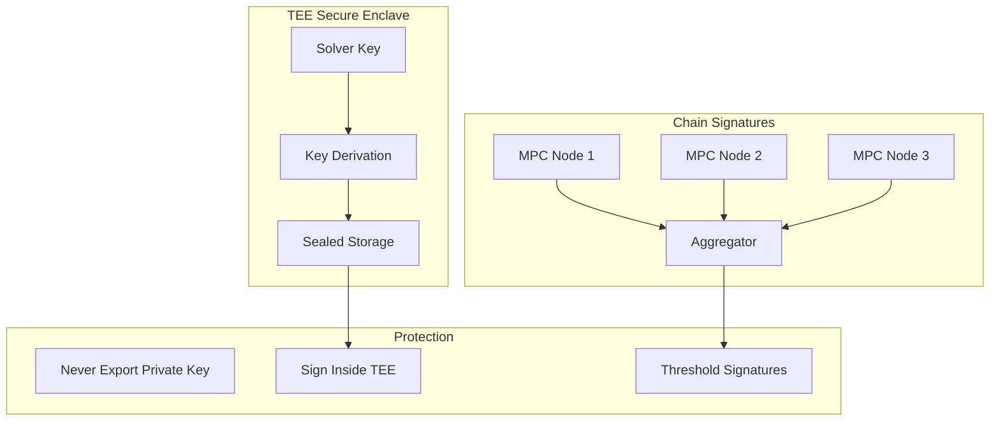
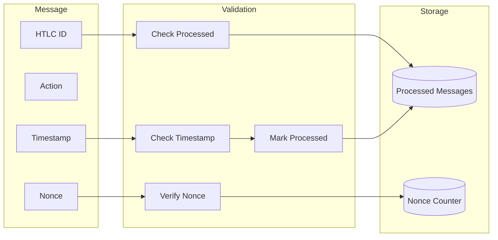
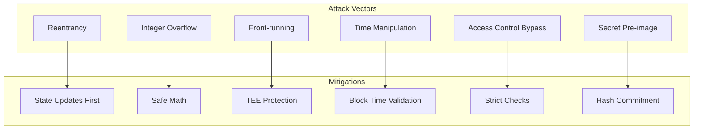
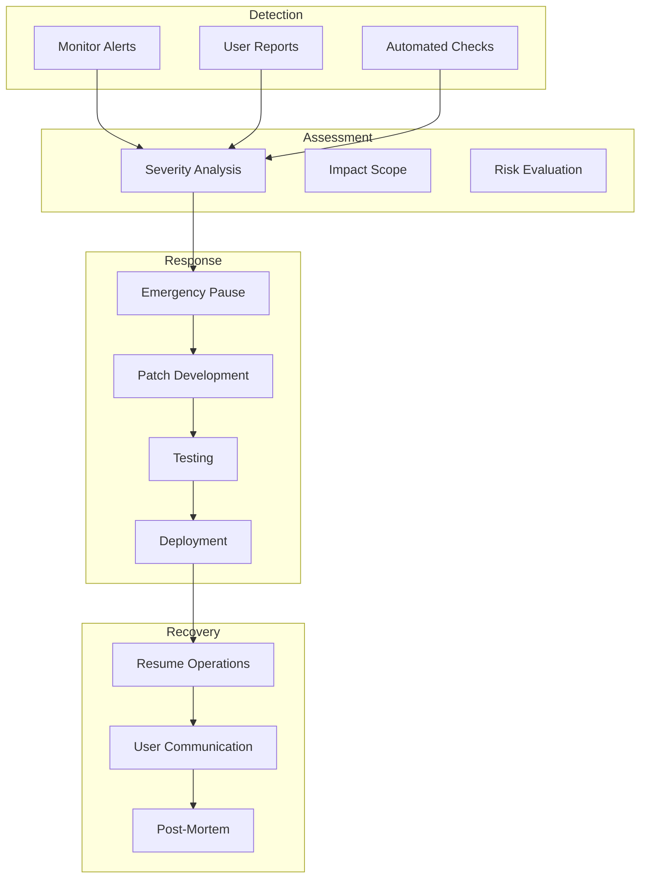

# NEAR Security Architecture

## Overview

This document details the comprehensive security architecture for the NEAR side of 1Balancer's cross-chain atomic swap system. Security is implemented at multiple layers to ensure safe, trustless execution.

## Security Model

### Defense in Depth



## HTLC Security

### Hashlock Implementation

```rust
// Secure hashlock validation
pub fn validate_secret(secret: &str, hashlock: &str) -> bool {
    // Remove 0x prefix if present
    let hashlock_clean = hashlock.trim_start_matches("0x");
    
    // Hash the secret using SHA-256
    let mut hasher = Sha256::new();
    hasher.update(secret.as_bytes());
    let hash = hasher.finalize();
    let hash_hex = hex::encode(hash);
    
    // Constant-time comparison to prevent timing attacks
    hash_hex == hashlock_clean
}
```

### Timeout Security



### State Machine Security



## Access Control

### Function-Level Security

```rust
// Strict access control implementation
impl FusionPlusContract {
    /// Only receiver can withdraw
    pub fn withdraw(&mut self, htlc_id: String, secret: String) -> Promise {
        let htlc = self.htlcs.get(&htlc_id).expect(ERR_HTLC_NOT_FOUND);
        
        // Access control check
        assert_eq!(
            env::predecessor_account_id(),
            htlc.receiver,
            "Only receiver can withdraw"
        );
        
        // Additional validations...
    }
    
    /// Only sender can refund
    pub fn refund(&mut self, htlc_id: String) -> Promise {
        let htlc = self.htlcs.get(&htlc_id).expect(ERR_HTLC_NOT_FOUND);
        
        // Access control check
        assert_eq!(
            env::predecessor_account_id(),
            htlc.sender,
            "Only sender can refund"
        );
        
        // Timeout validation...
    }
}
```

### Admin Functions Protection

```mermaid
graph LR
    subgraph "Admin Functions"
        A1[set_eth_orchestrator]
        A2[add_supported_token]
        A3[remove_supported_token]
    end
    
    subgraph "Protection"
        P1[assert_owner()]
        P2[Check predecessor]
        P3[Validate owner]
    end
    
    subgraph "Result"
        R1[✅ Execute]
        R2[❌ Revert]
    end
    
    A1 --> P1
    A2 --> P1
    A3 --> P1
    P1 --> P2
    P2 --> P3
    P3 --> R1
    P3 --> R2
```

## TEE Solver Security

### Attestation Verification



### Secure Key Management



## Cross-Chain Security

### Event Verification

```rust
// Event authenticity verification
pub struct EventVerifier {
    pub fn verify_cross_chain_event(
        &self,
        event: &CrossChainEvent,
        proof: &EventProof,
    ) -> Result<bool, Error> {
        // 1. Verify event source
        let valid_source = self.verify_source(&event.source_chain)?;
        
        // 2. Verify event hash
        let event_hash = self.compute_event_hash(event);
        let valid_hash = event_hash == proof.event_hash;
        
        // 3. Verify inclusion proof
        let valid_inclusion = self.verify_merkle_proof(
            &proof.merkle_proof,
            &event_hash,
            &proof.block_root
        )?;
        
        // 4. Verify block finality
        let valid_finality = self.verify_finality(
            &event.source_chain,
            &proof.block_number
        )?;
        
        Ok(valid_source && valid_hash && valid_inclusion && valid_finality)
    }
}
```

### Replay Attack Prevention



## Vulnerability Analysis

### Common Attack Vectors



### Security Audit Checklist

#### Contract Security
- [x] No reentrancy vulnerabilities
- [x] No integer overflow/underflow
- [x] Proper access control
- [x] State machine integrity
- [x] Event emission for monitoring
- [x] Emergency pause capability

#### Cryptographic Security
- [x] SHA-256 for hashlocks
- [x] Secure random generation
- [x] No hardcoded secrets
- [x] Proper secret handling
- [x] Timing attack resistance

#### Cross-Chain Security
- [x] Timeout coordination
- [x] Event verification
- [x] Replay protection
- [x] Atomicity guarantees
- [x] State synchronization

## Emergency Response

### Circuit Breaker Pattern

```rust
pub struct EmergencyControl {
    paused: bool,
    emergency_admin: AccountId,
}

impl EmergencyControl {
    pub fn emergency_pause(&mut self) {
        assert_eq!(
            env::predecessor_account_id(),
            self.emergency_admin,
            "Only emergency admin"
        );
        self.paused = true;
        env::log_str("EMERGENCY: Contract paused");
    }
    
    pub fn emergency_resume(&mut self) {
        // Multi-sig or time delay for resume
        self.validate_resume_conditions();
        self.paused = false;
        env::log_str("Contract resumed");
    }
}
```

### Incident Response Flow



## Monitoring and Alerting

### Security Metrics

```
┌─────────────────────────────────────────────────┐
│            Security Dashboard                   │
├─────────────────────────────────────────────────┤
│ Failed Withdrawals (24h):     3                 │
│ Timeout Refunds:              2                 │
│ Invalid Secrets:              5                 │
│ Access Violations:            0                 │
├─────────────────────────────────────────────────┤
│ Anomaly Detection                               │
│ • Unusual withdrawal pattern detected           │
│ • High frequency of failed attempts             │
│ • Potential replay attack blocked               │
├─────────────────────────────────────────────────┤
│ System Health                                   │
│ TEE Attestations:     ✅ Valid                  │
│ Chain Signatures:     ✅ Operational            │
│ Event Monitoring:     ✅ Active                 │
│ Emergency Systems:    ✅ Ready                  │
└─────────────────────────────────────────────────┘
```

### Alert Thresholds

| Metric | Warning | Critical | Action |
|--------|---------|----------|--------|
| Failed Withdrawals/hour | >10 | >50 | Investigate |
| Invalid Secrets/hour | >20 | >100 | Check for attack |
| Access Violations/hour | >5 | >20 | Review logs |
| Gas Spike | >150% | >300% | Emergency review |
| Event Lag | >30s | >2min | Check monitor |

## Best Practices

### Secure Development

1. **Code Review**: All changes require review
2. **Testing**: Comprehensive test coverage
3. **Fuzzing**: Automated vulnerability discovery
4. **Static Analysis**: Automated security checks
5. **Formal Verification**: Critical paths verified

### Operational Security

1. **Key Management**: Hardware security modules
2. **Access Control**: Multi-signature requirements
3. **Monitoring**: 24/7 automated monitoring
4. **Incident Response**: Documented procedures
5. **Regular Audits**: Third-party security reviews

## Conclusion

The NEAR security architecture implements defense in depth with:

- **Multiple validation layers**: From input to protocol level
- **Cryptographic guarantees**: SHA-256 hashlocks and commitments
- **Access control**: Role-based and state-based restrictions
- **TEE isolation**: Protected execution environment
- **Cross-chain security**: Event verification and replay protection
- **Emergency mechanisms**: Circuit breakers and pause capability

This comprehensive approach ensures the safety and integrity of cross-chain atomic swaps.