# NEAR System Architecture

## Overview

This document provides comprehensive architectural diagrams and explanations of how the NEAR components integrate with the overall 1Balancer system, following the pattern established in the Ethereum Hub documentation.

## System Component Architecture

### Complete System Integration

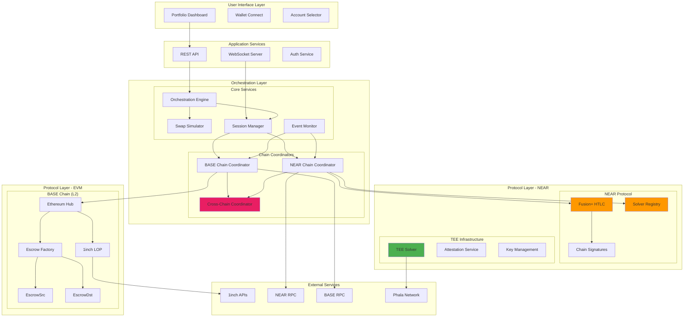

## Cross-Chain Message Flow

### Message Passing Architecture

```mermaid
graph LR
    subgraph "Message Generation"
        MG1[User Action]
        MG2[Create Message]
        MG3[Sign Message]
        MG4[Add Metadata]
    end
    
    subgraph "Source Chain Processing"
        SC1[Validate Message]
        SC2[Lock Assets]
        SC3[Emit Event]
        SC4[Generate Proof]
    end
    
    subgraph "Cross-Chain Bridge"
        BR1[Event Monitor]
        BR2[Message Queue]
        BR3[Validator Set]
        BR4[Consensus]
    end
    
    subgraph "Destination Chain Processing"
        DC1[Verify Proof]
        DC2[Validate State]
        DC3[Execute Action]
        DC4[Emit Confirmation]
    end
    
    subgraph "Finalization"
        F1[Confirm Both Sides]
        F2[Update State]
        F3[Notify User]
    end
    
    MG1 --> MG2 --> MG3 --> MG4
    MG4 --> SC1
    SC1 --> SC2 --> SC3 --> SC4
    SC4 --> BR1
    BR1 --> BR2 --> BR3 --> BR4
    BR4 --> DC1
    DC1 --> DC2 --> DC3 --> DC4
    DC4 --> F1 --> F2 --> F3
```

## NEAR Contract Internal Architecture

### Contract Component Interaction

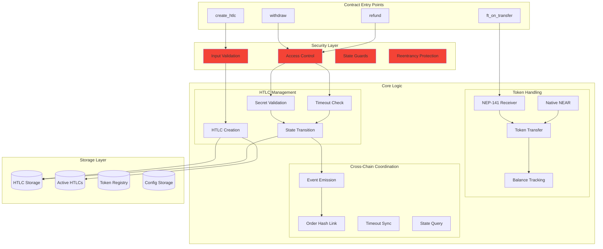

## Event-Driven Architecture

### Event Processing Pipeline

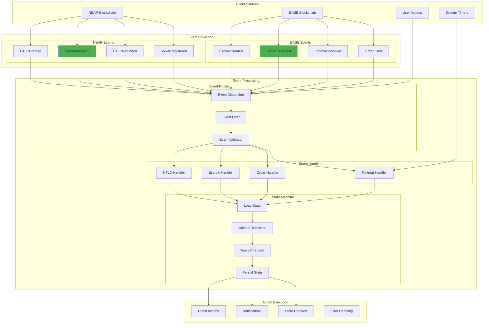

## TEE Solver Architecture Detail

### Solver Component Architecture

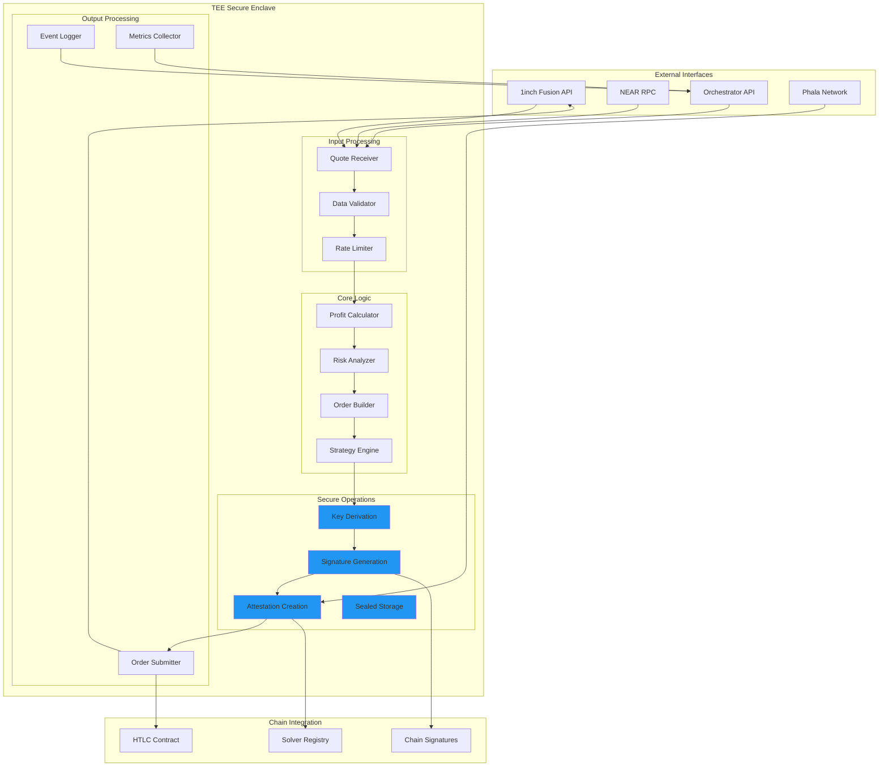

## Data Flow Architecture

### Complete Data Flow Through System

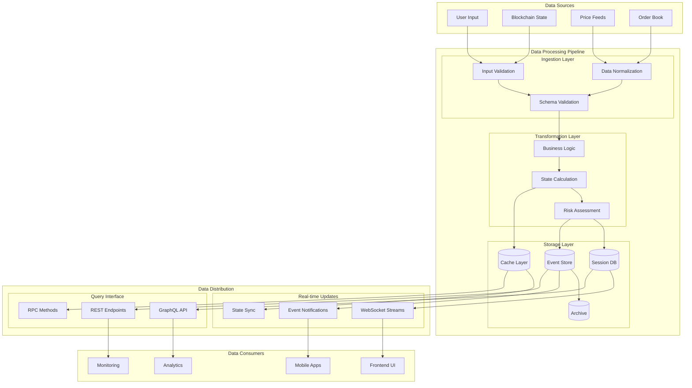

## Security Architecture Layers

### Defense-in-Depth Security Model

```mermaid
graph TB
    subgraph "Perimeter Security"
        PS1[DDoS Protection]
        PS2[WAF Rules]
        PS3[Rate Limiting]
        PS4[IP Filtering]
    end
    
    subgraph "Application Security"
        subgraph "Authentication Layer"
            AL1[Wallet Auth]
            AL2[Session Management]
            AL3[2FA/MFA]
        end
        
        subgraph "Authorization Layer"
            AZ1[Role-Based Access]
            AZ2[Permission Matrix]
            AZ3[Resource Guards]
        end
        
        subgraph "Validation Layer"
            VL1[Input Sanitization]
            VL2[Type Checking]
            VL3[Business Rules]
        end
    end
    
    subgraph "Protocol Security"
        subgraph "Cryptographic Layer"
            CL1[SHA-256 Hashlocks]
            CL2[Digital Signatures]
            CL3[Key Management]
        end
        
        subgraph "Smart Contract Security"
            SC1[Access Control]
            SC2[Reentrancy Guards]
            SC3[Integer Safety]
            SC4[State Machine]
        end
        
        subgraph "Cross-Chain Security"
            CC1[Timeout Coordination]
            CC2[Event Verification]
            CC3[Replay Protection]
        end
    end
    
    subgraph "Infrastructure Security"
        IS1[TEE Isolation]
        IS2[Network Segmentation]
        IS3[Encrypted Storage]
        IS4[Secure Communication]
    end
    
    PS1 --> PS2 --> PS3 --> PS4
    PS4 --> AL1
    
    AL1 --> AL2 --> AL3
    AL3 --> AZ1
    AZ1 --> AZ2 --> AZ3
    AZ3 --> VL1
    VL1 --> VL2 --> VL3
    
    VL3 --> CL1
    CL1 --> CL2 --> CL3
    
    CL3 --> SC1
    SC1 --> SC2 --> SC3 --> SC4
    
    SC4 --> CC1
    CC1 --> CC2 --> CC3
    
    CC3 --> IS1
    IS1 --> IS2 --> IS3 --> IS4
    
    style PS1 fill:#f44336
    style CL1 fill:#2196f3
    style SC1 fill:#4caf50
    style IS1 fill:#ff9800
```

## State Management Architecture

### Distributed State Synchronization

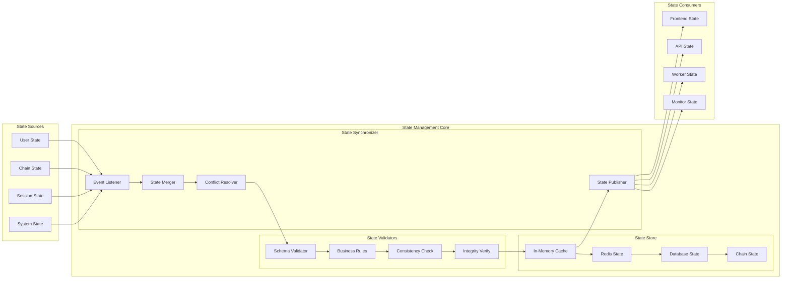

## Integration Architecture

### Service Integration Map

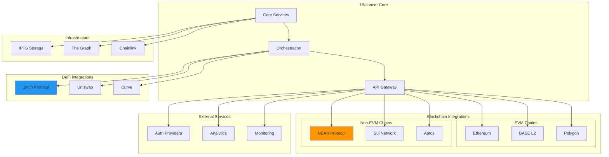

## Performance Architecture

### Optimization Layers

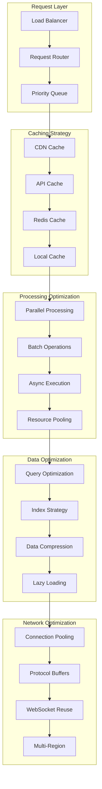

## Deployment Architecture

### Multi-Environment Deployment

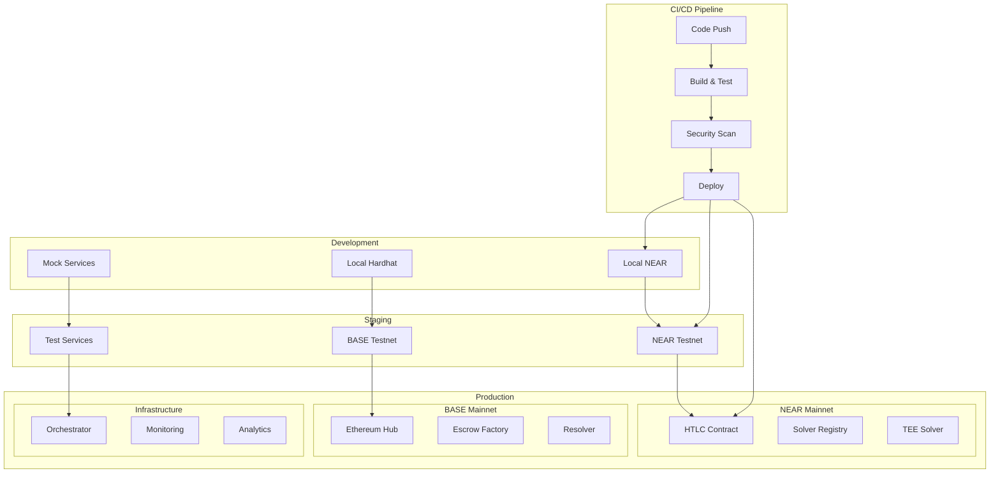

## Conclusion

This architecture provides:

1. **Comprehensive Integration**: All components work together seamlessly
2. **Security at Every Layer**: Defense in depth approach
3. **Scalable Design**: Can handle growth and additional chains
4. **Clear Separation**: Each component has defined responsibilities
5. **Event-Driven**: Reactive architecture for real-time operations
6. **Performance Optimized**: Multiple optimization strategies

The NEAR integration extends the Ethereum Hub architecture to support non-EVM chains while maintaining the same security guarantees and architectural principles.